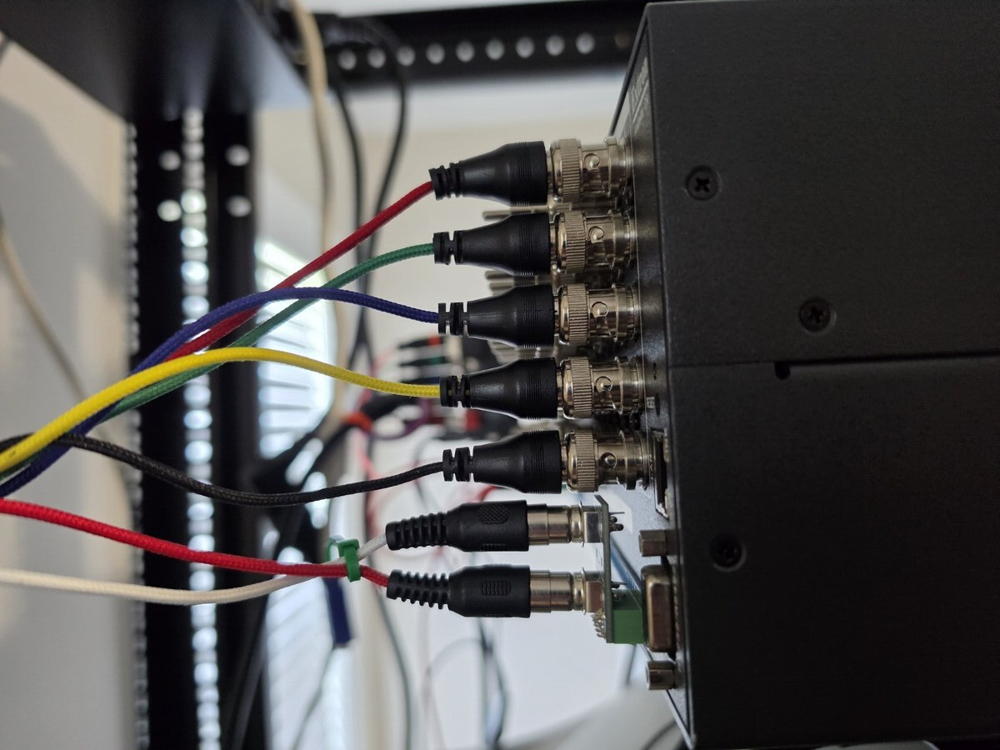

# RCA–Phoenix Adapter

This is my version of a left/right RCA adapter for Extron CrossPoint units.

> **Disclaimer:** The photos show a pre-release version. The version included in this repository has not been physically tested.

## Features

- Soldered Phoenix connector
- Lower profile than typical adapters, allowing access to the vertical BNC jack
- Sturdier than typical designs, making it easier to connect cables without damaging the adapter
- Uses the 1 kΩ resistor design from the Extron CSM 6 for bidirectional operation

## Bill of Materials

### Rear

**Phoenix connector**

- [LCSC part C6394081](https://www.lcsc.com/product-detail/C6394081.html?s_z=n_q_C6394081&globalKeyword=C6394081)

**Resistors**

- [LCSC part C57435](https://www.lcsc.com/product-detail/C57435.html?s_z=n_q_C57435&globalKeyword=C57435), or equivalent

### Front

**RCA connectors**

- Red/right: `RCJ-022`
- White/left: `RCJ-023`
- [AliExpress equivalent](https://www.aliexpress.us/item/3256807926580312.html?channel=twinner) — **not tested**

## Current Version

## Pre-Release Version

### Normal Installed Position

The adapter sits below the vertical BNC jack without blocking access to it.

### Cable Strain Test

The cable is intentionally pulling down on the adapter in this photo. This is not its normal resting position.

